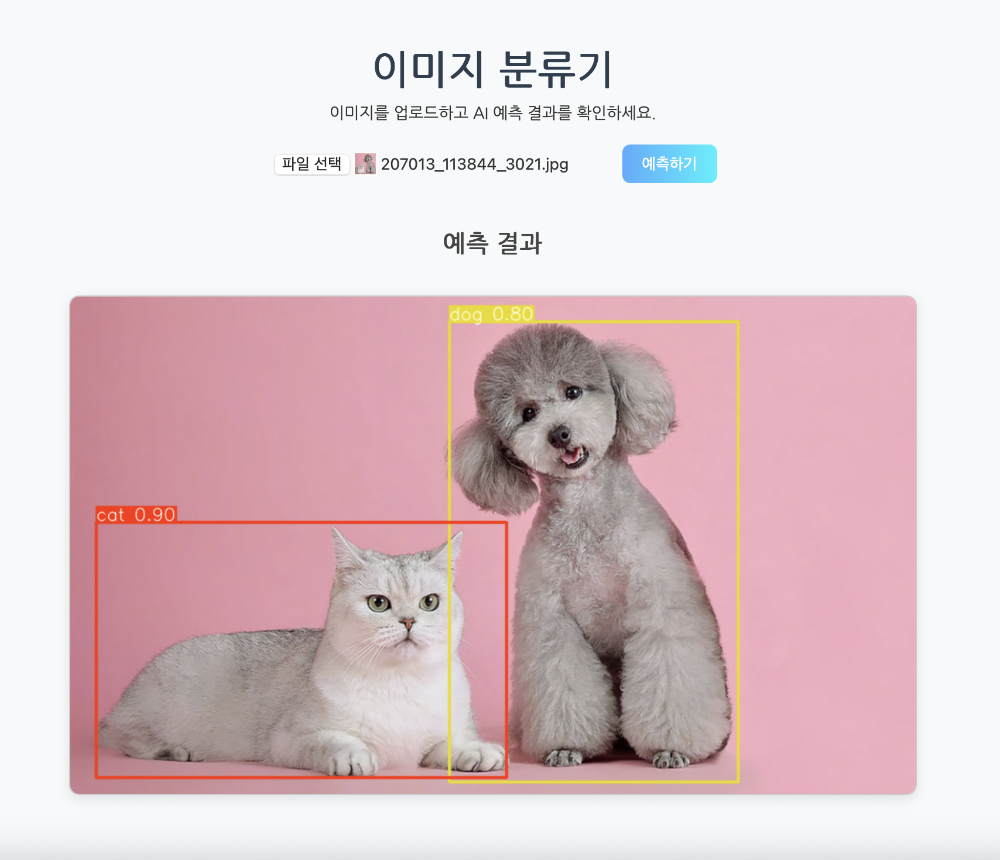

# YOLOv5 모델을 이용한 개 고양이 판별

---

본 프로젝트는 YOLOv5 (You Only Look Once v5) 객체 탐지 모델을 활용하여 이미지 내 **개(dog)**와 **고양이(cat)**를 실시간으로 판별하는 모델을 구축하는 것을 목표로 합니다.

YOLOv5는 빠르고 정확한 성능으로 다양한 객체 탐지(task)에 활용되고 있으며, 본 프로젝트에서는 해당 모델을 개/고양이 이진 분류(binary classification) 용도로 특화하여 실험하였습니다.


## 📁 데이터 구성 예시


본 프로젝트는 총 **3,716개의 이미지**를 사용하였으며, 이를 다음과 같이 분할하여 사용하였습니다:

- **학습(Train)**: 2,605장  
- **검증(Validation)**: 741장  
- **테스트(Test)**: 370장  

이미지는 모두 YOLO 포맷에 맞게 전처리되었으며, 디렉토리 구조는 다음과 같습니다:
```
data/
├── images/
│   ├── train/
│   │   ├── dog_001.jpg
│   │   └── cat_001.jpg
│   ├── val/
│   │   ├── dog_002.jpg
│   │   └── cat_002.jpg
│   └── test/
│       ├── dog_003.jpg
│       └── cat_003.jpg
└── labels/
    ├── train/
    │   ├── dog_001.txt
    │   └── cat_001.txt
    ├── val/
    │   ├── dog_002.txt
    │   └── cat_002.txt
    └── test/
        ├── dog_003.txt
        └── cat_003.txt
```

YOLO 라벨은 다음 포맷을 따릅니다:

```
[class_id] [x_center] [y_center] [width] [height]
```

- `0`: 고양이 (cat)
- `1`: 개 (dog)

---

## 📝 데이터 구성 설정 (data.yaml)

데이터 셋 구성에 대한 설정을 yaml 파일로 만들었습니다:
```yaml
train: ./data/images/train
val: ./data/images/val
test: ./data/images/test

nc: 2
names: ['cat', 'dog']
```

---

## 🚀 모델 학습
위에 명령어를 이용해 데이터 셋을 가지고 학습을 진행 했습니다.

```bash
python train.py \
  --img 640 \
  --batch 16 \
  --epochs 50 \
  --data dogcat.yaml \
  --cfg yolov5m.yaml \
  --weights yolov5m.pt \
  --name cat-or-dog
```

- `--img`: 입력 이미지 해상도
- `--batch`: 배치 사이즈
- `--epochs`: 에폭 수
- `--data`: 데이터 구성 파일
- `--cfg`: 모델 구조 설정
- `--weights`: 사전학습 가중치
- `--name`: 저장 디렉토리 이름

---


## 🔍 추론 및 테스트

- 첫번쨰, main.py를 실행합니다.
- 두번쨰, localhost:8000에 접속해 이미지를 선택하고 예측하기 버튼을 클릭합니다.
- 세번쨰, 이미지에 개, 고양이가 판별되면 네모 박스로 표시 됩니다



---

## ✅ 결론 및 향후 과제

본 프로젝트에서는 YOLOv5를 활용하여 개와 고양이를 정확히 구분하는 객체 탐지 모델을 성공적으로 구현하였습니다. 간단한 데이터셋 구성과 사전학습된 가중치를 바탕으로 빠르게 높은 정확도를 달성할 수 있었습니다.

### 📌 주요 성과
- 이미지에서 실시간 탐지 가능
- 가볍고 빠른 추론 속도로 실시간 애플리케이션에 적합

### 🔭 향후 개선 방향
- 다양한 견종/묘종 데이터 추가를 통한 정밀도 향상
- YOLOv8 또는 다른 최신 모델과의 성능 비교
- TensorRT 등으로 모델 경량화 및 모바일 디바이스 적용

---


## 📌 참고 자료

- [YOLOv5 GitHub (Ultralytics)](https://github.com/ultralytics/yolov5)
- [Roboflow Dogs vs. Cats Dataset](https://universe.roboflow.com/smartcarparkingsystem/cat-and-dog-u9yqb)